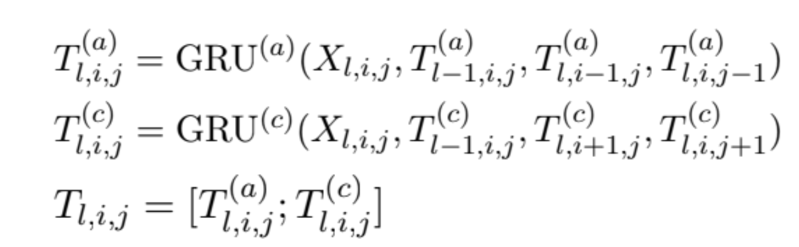
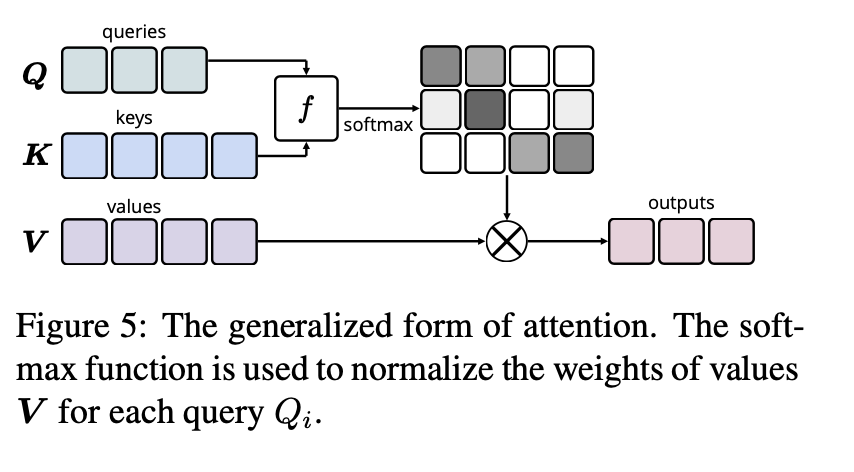

# Relation Extraction

## Relation extraction approaches based on assumptions on the expressiveness of training instances about the relations

 
#### 1. Sentence-level relation extraction - (The approach focused on this proposal)

Sentence-level relation extraction focuses on identifying the relationship between two entities in a sentence. Sentence-based annotated training data is used and the annotation contains sentence-triple alignment information. The sentences in the training set are labeled with the triples. The objective of the trained model is to predict new relations, given new entity pairs. 

However, a major drawback associated with this approach is the insufficient amount of training data, as labeled data is hard to come by in real-life scenarios. 

#### 2. Bag-level relation extraction

Knowledge graphs possess information about the relations between the entities in the form of (head, relation, tail) triples. These are used to enhance weakly labeled training datasets. For creating distant supervision datasets such as NYT, entity pairs in a triple are aligned with sentences that contain head and tail entities in the natural text. In this approach, the sentences matched by an entity pair constitute a bag.

A drawback associated with this approach is that these datasets are noisy and as the number of instances are not evenly distributed across relations, they are imbalanced. 

#### 3. Document-level relation extraction

The sentence-level approach to relation extraction does not take into account the entity pair relations across a document, that is, it ignores relations that can be deduced only by understanding several sentences within a document. These relations that can be extracted from multiple statements in a document can be beneficial for some domains. 

As of Fall 2020, performance of document-level relation extraction methods fall behind human performance when it comes to cross-sentence reasoning, therefore this approach needs more effort.

## Approaches to relation extraction

#### 1. Rule-based relation extraction

Relations in a sentence can be identified through hand-crafted rules, looking for triples (X, α, Y). Here, X and Y are the entities and α are words in between. For example, consider the sentence:

‘‘Steve Jobs founded Apple’’
Here, α=”founded”

This can be extracted with a regular expression. However, looking only at keyword matches will retrieve many false positives. This is avoided by filtering on named entities, that is, only retrieving (PERSON, founded, ORGANIZATION). The part-of-speech (POS) tags are also taken into consideration to remove additional false positives.

These examples use “word sequence patterns”, as the rule specifies a pattern following the order of the text. A drawback associated with these approaches is that the rules fall apart for longer-range patterns and sequences with greater variety. 

In another approach, dependency paths are used. Dependency paths help identify which words in the sentence have a grammatical dependency on other words and hence can greatly increase the coverage of the rule. 

A few other approaches also transform the sentences before applying the rule. E.g. “The cake was baked by Harry” or “The cake which Harry baked” can be transformed into “Harry baked the cake”. The order of the words in the sentence are changed to work with the “linear rule”, while also removing redundant modifying words in between.

#### 2. Supervised relation extraction

Supervised relation extraction approaches use sentence-level relation extraction approaches and require labelled data. Each pair of entity mentions are labelled with one of the pre-defined relation types. Many methods involve training a classifier to classify the entity pairs according to the relation type they belong to. 

#### a. Conventional neural models for relation extraction:

Recent methods focus on extracting relational features with neural networks instead of manual work. A proposed approach is the use of a recurrent deep neural network model, where each expression is represented by a vector and a matrix. The semantic information of the expression is represented by the vector, while the matrix represents how much it influences the meaning of syntactically neighboring expressions. 

Another proposed approach is to utilize convolutional neural networks that can combine local features to get a globally representative feature. 

In another approach, an LSTM model is used, which takes advantage of the shortest dependency path(SDP)  between entities. Dependency trees are directed graphs which represent the relationship possessed by the syntactic units, and so there is a need to differentiate whether the first entity is related to the second entity or the relation is implied in the reverse direction. Uni-directional LTSM models do not represent the complete sequential information of the sentences, so some approaches use a bidirectional LSTM model (BLSTM) to better represent the sentences. 

As meaningful information can be located anywhere in a sentence, a proposed approach is to incorporate attention mechanism to BLSTM network to capture the informative parts of the sentence. This is done rather than using features from dependency parsers and named entity recognizers. 

More recent approaches look at the extraction of entities along with their relations, as pipeline approaches, where the entities are first found and then matched with the appropriate relation are prone to error propagation. 

#### b. Pre-trained language models for relation extraction 

Transfer learning is a technique in which a model developed for a specific task can be used as a starting point and fine tuned to achieve another related task. It is commonly used in deep learning to transfer existing knowledge of a model to another similar or related task’s model. These pre-trained models save plenty of time and computational power. BERT, Transformer-XL and OpenAI’s GPT-2 are some widely used pre-trained models for NLP tasks.

A commonly used pre-trained model, BERT makes use of transformer, an attention mechanism. It captures the contextual relationship between the words in a sentence along with the semantic relation of the sentence to the neighbouring sentences in the whole text. 

#### 3. Distantly supervised relation extraction

In distance supervised relation extraction approaches, the training data is automatically generated, The seed triples are taken from existing related knowledge graphs. The triples are aligned with the sentences in the input text, with the assumption that all the sentences that contain the head and tail entities of the triple express the relation. It determines which sentences support which relation and to what degree the relation of interest is expressed. The sentences that match these triples are selected and labeled with the appropriate relation and act as the training data.

 A drawback associated with this approach is that an error-prone training set is generated, as it may contain wrongly labeled instances. 

For example, consider a triple (Bill gates, Founder, Microsoft) from a knowledge base and two sentences: 

‘‘Bill Gates is the co-founder of Microsoft.’’ 
‘‘The greatest mistake of Bill Gates cost Microsoft $400 billion.’’ 

The first sentence expresses the “Founder” relation, while the second does not. The training set including the second sentence is said to be noisy or wrongly labeled.

A few approaches to limit the noise in the training dataset is to use sentence-level attention, hierarchical attention, multilingual knowledge extraction, joint extraction with knowledge graphs or introducing human annotation to relation extraction.

#### 4. Unsupervised relation extraction

Unsupervised relation extraction involves extracting relations from text without having to manually label any training data, write rules to capture different types of relations or use seed triples from existing knowledge bases. This can be applied to domains where annotated data and knowledge bases are not available. Unsupervised relation extraction methods can be used to extract new relation types; it is not restricted to specific relation types like in the case of supervised or distantly supervised methods. These methods can be categorised into two approaches: generative and discriminative. Open Information Extraction (Open IE) generally refers to this paradigm.

# Approach Selected

Title of the paper whose approach is followed in this proposal:  Two are Better than One: Joint Entity and Relation Extraction with Table-Sequence Encoders

Link to paper: <https://arxiv.org/abs/2010.03851> 

Brief overview:

- This approach learns two separate encoders – a table encoder and a sequence encoder. They interact with each other, and can capture task specific information for the NER and RE tasks;
- Uses multidimensional recurrent neural networks to better exploit the structural information of the table representation;
- Effectively leverages the word-word interaction information carried in the attention weights from BERT, which further improves the performance.

Problem Formulation: 

- NER task is treated as a sequence labeling problem, where the gold entity tags yNER are in the standard BIO (Begin, Inside, Outside) scheme 
- RE task is treated as a table filling problem.

Model

- The model consists of two types of **interconnected** encoders, **a table encoder for table representation** and **a sequence encoder for sequence representation.**Collectively, called **table-sequence encoders**. This is represented in Figure 2.

Link to the model part of the code: <https://github.com/LorrinWWW/two-are-better-than-one/blob/master/models/joint_models.py> 

- Figure 3 presents the details of each layer of the two encoders, and how they interact with each other. **In each layer, the table encoder uses the sequence representation to construct the table representation; and then the sequence encoder uses the table representation to contextualize the sequence representation.** With multiple layers, they incrementally improve the quality of both representations.

- **Text Embedder:**  For a sentence containing N words x = [xi]1≤i≤N , it is defined

**(1) word embeddings xw ∈ RN×d1**, **as well as**  

**(2) character embeddings xc ∈ RN×d2 computed by an LSTM** (Lample et al., 2016).

**(3) contextualized word embeddings x` ∈ RN×d3, which can be produced from language models such as BERT.** 

The above is **concatenated for** **embeddings for each word** 

and 

**use a linear projection to form the initial sequence representation S0 ∈ RN×H:** 

S0 = Linear([xc; xw; x`]) 

where each word is represented as an H dimensional vector. 

- **Table Encoder:** The table encoder, shown in the left part of Figure 3, is a neural network used to learn a table representation, an N × N table of vectors, where the vector at row i and column j corresponds to the i-th and j-th word of the input sentence. 

**They first construct a non-contextualized table by concatenating every two vectors of the sequence representation followed by a fully-connected layer to halve the hidden size.**

Formally, for the l-th layer, they have Xl ∈ RN×N×H, where: 

Xl,i,j = ReLU(Linear([Sl−1,i; Sl−1,j ])) 

Next, the paper uses the **Multi-Dimensional Recurrent Neural Networks** (MD-RNN, Graves et al. 2007) **with Gated Recurrent Unit** (GRU, Cho et al. 2014) **to contextualize Xl.** 

Then, they **iteratively compute the hidden states of each cell to form the contextualized table representation T l,** where: 

Tl,i,j = GRU(Xl,i,j , Tl−1,i,j , Tl,i−1,j , Tl,i,j−1)

Generally, it **exploits the context along layer, row, and column dimensions.** That is, it does not consider only the cells at neighbouring rows and columns, but also those of the previous layer. 

The time complexity of the naive implementation (i.e., two for-loops) for each layer is O(N ×N) for a sentence with length N. However, anti-diagonal entries can be calculated at the same time as they do not depend on each other. Therefore, they can optimize it through parallelization and reduce the effective time complexity to O(N). 

The above illustration describes a unidirectional RNN, corresponding to Figure 4(a). Intuitively, **they would prefer the network to have access to the surrounding context in all directions.** However, this could not be done by one single RNN. For the case of 1D sequence modeling, this problem is resolved by introducing bidirectional RNNs. Graves et al. (2007) discussed quad directional RNNs to access the context from four directions for modeling 2D data. Therefore, similar to 2D-RNN, they also need to consider RNNs in four directions. They visualize them in Figure 4. 

Empirically, they found **the setting only considering cases (a) and (c) in Figure 4 achieves no worse performance than considering four cases altogether. Therefore, to reduce the amount of computation, they use such a setting as default.** 

**The final table representation is then the concatenation of the hidden states of the two RNNs**: 

/>

- **Sequence encoder:** The sequence encoder is used to learn the sequence representation – a sequence of vectors, where the i-th vector corresponds to the i-th word of the input sentence
- **Training and Evaluation**: The paper use SL and T L to predict the probability distribution of the entity and relation tags: 

Pθ(YNER) = softmax(Linear(SL)) 

Pθ(YRE) = softmax(Linear(T L))

where **YNER and YRE are random variables of the predicted tags,** and **Pθ is the estimated probability function with θ being our model parameters.** 

For training, both NER and RE adopt the prevalent cross-entropy loss. Given the input text x and its gold tag sequence yNER and tag table yRE, they then calculate the following two losses: 

During evaluation, the prediction of relations re- lies on the prediction of entities, so they first predict the entities, and then look up the relation proba- bility table Pθ (YRE ) to see if there exists a valid relation between predicted entities.					

Specifically, they predict the entity tag of each word by choosing the class with the highest probability:					

Argmax Pθ(YiNER =e) (16) e 		

